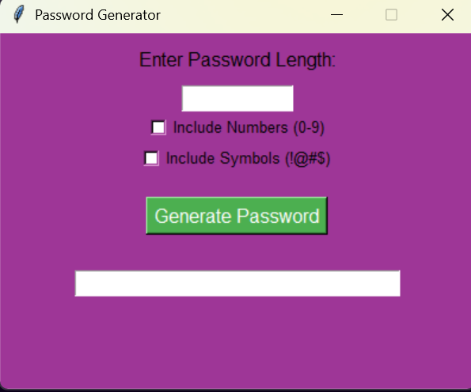

# 🔐 Password Generator (GUI with Python & Tkinter)-Python Internship Project

Secure your accounts with style and strength!  
This project is a simple yet powerful password generator built using **Python and Tkinter**. It lets you customize password length and choose whether to include **numbers and symbols** — all through a clean, interactive GUI.

---

### 🖥️ Preview

- A graphical app with input fields, checkboxes, and a generated password output.
- User-friendly, no terminal required!

---

### 🚀 Features

- 🔢 Choose your desired **password length**
- 🔐 Choose whether to include **numbers (0–9)** or **symbols (!@#$...)**
- 🎲 Generates a **completely random, secure password**
- 🪄 Easy-to-use GUI using **Tkinter**
- 📋 Copyable password field

---

### 🛠️ Technologies Used

| Tool       | Purpose                   |
|------------|----------------------------|
| Python     | Core programming language  |
| Tkinter    | GUI interface              |
| `random`   | Secure random generation   |
| `string`   | Character sets used        |

---

### 💡 What I Learned

- Working with GUI components in Tkinter
- Managing user input and validations
- Randomized secure password logic
- Basic UI/UX design using Python's native tools

---

### 📦 How to Run

1. Make sure you have Python installed:
   ```bash
   python --version
2. Run the app:
    ```bash
    python passwd_generator_gui.py

  No external libraries needed — Tkinter is built-in!

---


## ✨ Visualization


📸 

---

## 🧠 Fun Fact
This was built as part of my internship projects to explore user-defined functions, randomization, and basic cybersecurity principles 🛡️

---
